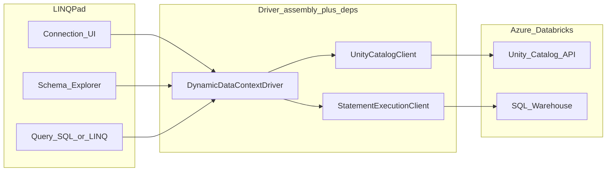

# Epic 001: Azure Databricks LINQPad Data Context Driver

## Canonical plan document

**This file ([docs/epic-001-extension-creation.plan.md](epic-001-extension-creation.plan.md)) is the source of truth for this epic.** Update the plan here only. Do not treat Cursor-generated plan files under `.cursor/plans/` as authoritative; if a duplicate exists, reconcile or delete it after copying any unique edits into this document.

## References

- **Primary LINQPad spec:** *Writing a LINQPad Data Context Driver* (**DataContextDrivers8.docx**, last updated 2025-03-11 in the copy used for this plan). Keep a copy in-repo (for example under `docs/vendor/`) so CI and contributors do not depend on a single workstation path. The same document is linked from [LINQPad Data Context Extensibility](https://www.linqpad.net/Extensibility.aspx).
- [LINQPad Data Context Extensibility](https://www.linqpad.net/Extensibility.aspx): download page for the docx, **[CreateDCDriverProject.linq](https://www.linqpad.net/CreateDCDriverProject.linq)** template script, and sample projects.
- Azure Databricks: [Statement Execution API](https://learn.microsoft.com/en-us/azure/databricks/dev-tools/sql-execution-tutorial) (`POST /api/2.0/sql/statements`, poll `GET /api/2.0/sql/statements/{statement_id}`) for SQL on a **SQL warehouse**.
- Unity Catalog metadata: `GET /api/2.1/unity-catalog/catalogs`, `.../schemas`, `.../tables` (and list endpoints with `catalog_name` / `schema_name` query parameters as documented for your workspace API version). `SHOW CATALOGS` / `INFORMATION_SCHEMA` via the warehouse is a valid fallback if REST permissions differ.

## Goals

1. **Add Connection UX**: custom connection dialog (workspace URL, auth, warehouse id, optional default catalog/schema, TLS).
2. **Schema Explorer**: enumerate **catalogs** → **schemas** → **tables** and **views** (Unity Catalog `table_type` distinguishes views; hive metastore legacy names may appear as catalogs—handle both where applicable).
3. **Run SQL**: user can execute arbitrary SQL (Databricks SQL dialect) and see tabular results in LINQPad.

## Non-goals (initial epic)

- Publishing to the LINQPad Driver Gallery (optional later).
- Full LINQ translation to remote SQL (beyond whatever the driver template provides for dynamic contexts).
- Cluster/Jobs API or notebooks execution (warehouse SQL only).

## High-level architecture



- **Single .NET class library** referencing the **`LINQPad.Reference`** NuGet package (per DataContextDrivers8). **Do not target .NET Standard** for the driver project: the connection UI must be **WPF or Windows Forms** on Windows. The official doc lists TFMs such as `netcoreapp3.1`, `net5.0-windows`, `net6.0-windows`, `net7.0-windows`, `net8.0-windows`—pick the lowest compatible TFM that matches your dependencies; **`net8.0-windows`** is a reasonable default for new work in 2025–2026.
- **macOS / cross-platform (March 2025 doc update):** LINQPad for macOS supports third-party drivers when the driver and dependencies are macOS-compatible and the connection dialog is **WPF** so LINQPad can host it under **XPF** (only from `ShowConnectionDialog`; do not touch WPF types elsewhere). For NuGet packaging, remove the **`-windows`** suffix from `lib` TFM folders (for example use `net8.0` not `net8.0-windows` under `lib/`) so the package is not invisible on macOS. Treat Windows-first delivery as phase 1 unless you explicitly multi-target and test on macOS.
- **Two HTTP clients** (or one with clear route prefixes): Unity Catalog (`/api/2.1/unity-catalog/...`) and SQL Statement Execution (`/api/2.0/sql/...`), both against the same host `https://adb-<workspace-id>.<region>.azuredatabricks.net` (Azure pattern).
- **Auth**: start with **Personal Access Token (PAT)** in the `Authorization: Bearer` header (simplest path). Add **Azure AD** (OAuth client credentials or interactive) as a follow-up if required—same REST endpoints, different token acquisition.

## LINQPad driver shape (from DataContextDrivers8.docx)

Use the skeleton from **CreateDCDriverProject.linq** plus the doc as the source of truth.

### Base class: `DataContextDriver`

Implement at least these **abstract** members on `DataContextDriver` (namespace `LINQPad.Extensibility.DataContext`):

- `Name`, `Author`
- `GetConnectionDescription(IConnectionInfo cxInfo)` — text for the Schema Explorer root.
- `ShowConnectionDialog(IConnectionInfo cxInfo, ConnectionDialogOptions options)` — modal **WPF or WinForms** dialog; return `false` to roll back edits to `IConnectionInfo`.

Persist custom fields via **`IConnectionInfo.DriverData`** (`XElement`). Use **`IConnectionInfo.Encrypt` / `Decrypt`** for secrets (for example PAT), not plain text in `DriverData`.

### Dynamic driver: `DynamicDataContextDriver`

Subclass **`DynamicDataContextDriver`** and implement:

```csharp
public abstract List<ExplorerItem> GetSchemaAndBuildAssembly(
    IConnectionInfo cxInfo,
    AssemblyName assemblyToBuild,
    ref string nameSpace,
    ref string typeName);
```

This method must **(1)** emit and compile a typed data context assembly (use the base helper **`CompileSource`**), and **(2)** return the **`List<ExplorerItem>`** tree for Schema Explorer. LINQPad runs **`GetSchema` / `GetSchemaAndBuildAssembly` in an isolated driver process**, so you can load assemblies without locking concerns.

Build **`ExplorerItem`** children to mirror Databricks **catalog → schema → table/view** (kinds/icons per doc: `ExplorerItemKind`, `ExplorerIcon`).

Optional but valuable for databases: override **`GetLastSchemaUpdate(IConnectionInfo cxInfo)`** so LINQPad can refresh Schema Explorer after DDL when the user runs SQL.

### SQL query language support

Per doc section *Supporting SQL Queries*, when the query language is **SQL**, LINQPad uses ADO-style entry points. On **.NET Core 3.1+** you generally **must not rely on `DbProviderFactories.GetFactory` alone**; plan to override one or both of:

- **`GetProviderFactory(IConnectionInfo cxInfo)`** — return a `DbProviderFactory` for your driver, **or**
- **`GetIDbConnection(IConnectionInfo cxInfo)`** — return an **`IDbConnection`** directly; the doc states this **makes `GetProviderFactory` redundant** for obtaining a connection.

The default `GetIDbConnection` builds a connection from **`cxInfo.DatabaseInfo.GetCxString()`** and the provider factory; you may still override it to construct a **custom connection object** that wraps the Databricks Statement Execution API (no traditional JDBC/ODBC required if you implement `IDbConnection` / `IDbCommand` / `IDataReader` yourself or bridge to `DbConnection` subclasses).

Optionally override **`OpenConnection`** for token refresh / user prompts; respect **`DataContextDriver.IsAutomated`** (no UI when running under **`lprun`**). Use **`SaveNewPassword`** if you add rotation flows later.

**Definition of done for “Run SQL”:** user sets language to **SQL**, runs a query, and results render through this ADO surface backed by the Statement Execution API.

### Other doc-driven notes

- **Debugging:** `Debugger.Launch()` in the worker process; driver assemblies are not locked—rebuild + post-build copy while LINQPad stays open.
- **Dependencies:** prefer NuGet; for file-based installs include **`.deps.json`** so LINQPad can restore transitive packages. Avoid unnecessary dependencies in the query merge graph.
- **Static constructor / FirstChanceException** pattern from the doc is optional diagnostic glue, not a product requirement.

## Databricks integration details

| Concern | Approach |
|--------|----------|
| Host | Parse/normalize Azure workspace URL; reject unexpected formats early in the dialog. |
| Warehouse | User supplies **warehouse id** (GUID). Required for Statement Execution API. |
| List catalogs | `GET .../unity-catalog/catalogs` with pagination if `next_page_token` is returned. |
| List schemas | `GET .../unity-catalog/schemas?catalog_name=...` |
| List tables/views | `GET .../unity-catalog/tables?catalog_name=...&schema_name=...` — use `table_type` for icons / filtering. |
| Execute SQL | `POST /api/2.0/sql/statements` with `warehouse_id`, `statement`, `wait_timeout` / `on_wait_timeout`; poll until `SUCCEEDED` or terminal error; download result via embedded `result` data or external links per API response. |
| Errors | Surface Databricks `error` object (message, error_code) in LINQPad-friendly exceptions and connection test failures. |

**Entitlements**: Unity Catalog REST listing requires UC-enabled workspace and appropriate permissions (`USE CATALOG`, etc.). Document required workspace features in the epic README later—not in this plan file unless you expand scope.

## Packaging and distribution (from DataContextDrivers8.docx)

- **File-based:** zip the publish/output folder (driver DLL + dependencies + `.deps.json` when applicable) and rename to **`.LPX6`** (primary format in the doc); the UI also references **`.LPX`** for browsing older packages. LINQPad extracts into `%localappdata%\LINQPad\Drivers\DataContext\NetCore\<DriverName>` (or portable `drivers\DataContext\...`).
- **NuGet (recommended in doc):** enable “Generate NuGet package on build”, set package tags to **`linqpaddriver`** (no hyphen). **Package ID must match the driver assembly name.** Same package can be published to a private feed or folder source for testing.
- **Dev loop:** the template script’s **post-build event** copies build output to the `NetCore\<DriverName>` folder so LINQPad discovers the driver without manual steps.
- **Secrets:** store tokens/passwords with **`IConnectionInfo.Encrypt`** / **`Decrypt`**; never ship secrets inside the driver binary.

## Testing strategy

- **Unit tests** (separate test project): HTTP client with mocked handlers for UC list + statement lifecycle (PENDING → SUCCEEDED with small result).
- **Integration tests** (manual or gated CI): optional secrets via env vars; run against a dev workspace to validate catalog recursion and a `SELECT 1`.
- **LINQPad manual checklist**: add connection, expand tree for known catalog, run `SHOW TABLES IN ...`, run `SELECT` with multiple columns and ~10k rows (pagination / chunk handling).

## Risks and mitigations

- **SQL mode vs REST-only**: mitigate with **`GetIDbConnection` / `GetProviderFactory`** and an ADO-shaped façade on the Statement Execution API (see *Supporting SQL Queries* in DataContextDrivers8).
- **Large result sets**: use `DISPOSITION` / external links and streaming if the API returns manifest URLs—design reader to page rather than load all rows into memory.
- **API version drift**: pin documented REST versions; add integration test that fails visibly when Azure changes behavior.
- **Hive metastore vs UC**: some workspaces expose `hive_metastore` catalog; ensure enumeration does not assume only UC-managed catalogs.

## Suggested repository layout (implementation phase)

- `src/LinqPad.Databricks.Driver/` — driver project
- `src/LinqPad.Databricks.Client/` (optional) — REST clients shared with tests
- `tests/LinqPad.Databricks.Tests/` — unit tests
- `docs/epic-001-extension-creation.plan.md` — this epic (canonical)

## Implementation order

1. Pull official driver skeleton (**CreateDCDriverProject.linq**) and confirm TFM + references from **DataContextDrivers8.docx**.
2. Implement **DatabricksRestClient** (auth header, JSON, error mapping).
3. Implement **Unity Catalog** enumeration used by **GetSchemaAndBuildAssembly** (or equivalent) to populate Schema Explorer.
4. Implement **Statement Execution** end-to-end; smallest path: `DataTable` from first result chunk.
5. Wire **SQL mode** by overriding **`GetIDbConnection`** and/or **`GetProviderFactory`** so LINQPad’s SQL queries use your **Statement Execution**-backed connection/commands.
6. Polish connection dialog (test connection, validation), package **`.LPX6`** (and optionally NuGet), write user-facing **README** (separate from this epic unless you want README in same PR).
